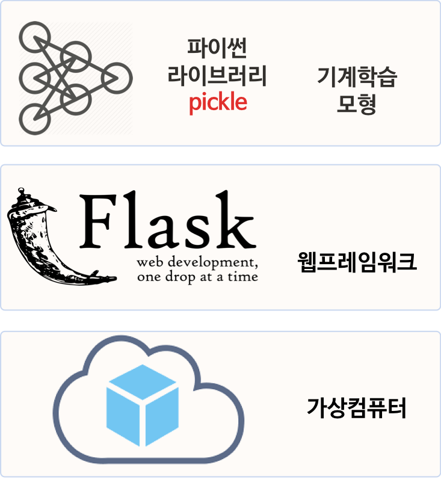
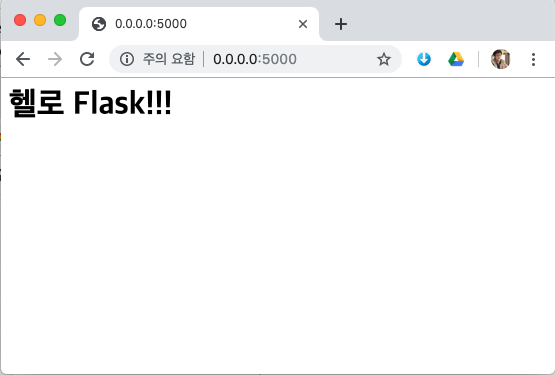

```{r setup, include=FALSE}
knitr::opts_chunk$set(echo = TRUE, message=FALSE, warning=FALSE,
                      comment="", digits = 3, tidy = FALSE, prompt = FALSE, fig.align = 'center')

library(reticulate)
use_condaenv("anaconda3")
# reticulate::repl_python()
```


# 기계학습 모형 배포 개요 {#nlp-deployment-overview}

기계학습 모형 배포는 서버 구축, 파이썬의 경우 `flask` 프레임워크(framework) 설치, 
기계학습 모형개발, 개발된 기계학습 모형 배포 순으로 작업이 진행된다.

먼저 [DigitalOcean](https://www.digitalocean.com/) 웹사이트에 가상 컴퓨터를 하나 생성시키고 나서, flask 프레임워크를 설치하고 개발된 머신러닝 모형을 `pickle`에 담아 배포한다.

 

# `flask` 프레임워크 [^flask-python] [^medium-flask] {#nlp-deployment-flask}

[^flask-python]: [Python for Undergraduate Engineers, "Building a single page Flask App on Digital Ocean
"](https://pythonforundergradengineers.com/flask-app-on-digital-ocean.html#acquire-and-configure-a-domain-name)

[^medium-flask]: [readbetweenthelines (Apr 4, 2017), "Python Flask 프레임워크 이해하기 - 30분만에 간단한 정적 페이지 만들기"](https://medium.com/@feedbots/python-flask-%ED%94%84%EB%A0%88%EC%9E%84%EC%9B%8C%ED%81%AC-%EC%9D%B4%ED%95%B4%ED%95%98%EA%B8%B0-41c7c6e97d08)


1. `virtualenv` 명령어를 사용해서 flask프레임워크를 올릴 가상환경을 생성시키고 활성화한다.
    - `$ virtualenv -p python3 flaskapp`
    - `$ source flaskapp/bin/activate`
1. `flask` 프레임워크 의존성을 설치한다.
    - `pip install wheel`
    - `pip install flask`
    - `pip install uwsgi`
    - `pip freeze > requirements.txt`
        - `requirements.txt` 파일에 연관된 라이브러리를 정리해 둔다.
1. 앱개발 - 헬로월드
    - `nano flaskapp.py` 명령어로 웹앱을 작성한다.
    
```{r flask-hello-world, eval=FALSE}
# flaskapp.py

from flask import Flask
app = Flask(__name__)

@app.route("/")
def index():
    return "<h1>헬로 Flask!!!</h1>"

if __name__ == "__main__":
    app.run(host='0.0.0.0')
```

4. 앱실행 
    - `$ python flaskapp.py` 명령어를 실행시키고, 웹브라우저 상단에 `http://0.0.0.0:5000/`을 넣게 되면 아주 간단하지만 큰 의미를 갖는 헬로월드 앱을 만들게 된 것이다.

```{r flask-run, eval=FALSE}
(flaskapp) xxxxxxxx@MacBook:~/swc/nlp$ python flaskapp.py 
 * Serving Flask app "flaskapp" (lazy loading)
 * Environment: production
   WARNING: This is a development server. Do not use it in a production deployment.
   Use a production WSGI server instead.
 * Debug mode: off
 * Running on http://0.0.0.0:5000/ (Press CTRL+C to quit)
```




<style>
div.blue { background-color:#e6f0ff; border-radius: 5px; padding: 10px;}
</style>
<div class = "blue">

**`virtualenv` 기본 명령어 [^virtual-env]**

[^virtual-env]: [개발새발로그, "Python virtualenv 정리 (Linux/Windows)"](https://dgkim5360.tistory.com/entry/python-virtualenv-on-linux-ubuntu-and-windows)

`virtualenv`는 파이썬 내부에 작은 격리된 파이썬 개발환경을 구축하는 것으로 
하이퍼바이저(hypervisor) 위에 가상 컴퓨터(Virtual Machine)를 만드는 것과 유사하다고 볼 수 있다.

- `virtualenv` 설치
    - `$ pip3 install virtualenv` 명령어로 파이썬 가상환경 구축 도구를 설치한다.
- 파이썬 가상환경 구축
    - `$ python3.6 -m venv flaskapp`
        - 파이썬 3.6 버젼으로 된 `flaskapp` 디렉토리에 파이썬 가상환경 구축
- 파이썬 가상환경 활성화
    - `$ source flaskapp/bin/activate`
    - 명령 프롬프트가 가상환경 활성화로 변경
        - `$` &rarr; `(flaskapp)$`
- 파이썬 가상환경 빠져나오기
    - `(flaskapp)$ deactivate` 혹은 `(flaskapp)$ source deactivate` 
    - 가상환경 명령 프롬프트가 일반 쉘 프롬프트로 변경
        - `(flaskapp)$` &rarr; `$`

</div>

# 기계학습 모형 배포 [^deploy-machine-learning-model] {#nlp-ml-deploy}

[^deploy-machine-learning-model]: [Hemang Vyas (Dec 1, 2018), "Deploy a machine learning model using flask"](https://hackernoon.com/deploy-a-machine-learning-model-using-flask-da580f84e60c)

기계학습 모형 배포는 기계학습 모형을 `pickle`에 담아 `salary_model` 객체를 `salary_model.pkl`에 담아 넣는 과정부터 시작된다.
이를 flask 프레임워크에서 불러 쓸 수 있도록 가져온다. `pickle.load(open('model/salary_model.pkl','rb'))` 명령어를 사용해서 서버에 올려서 예측모형의 경우 `X` 값을 받아 `y`를 반환시키는 것이라 `X`를 `request.py` 파일에 POST 형식으로 받아 이를 예측모형에 넣어 연봉 예측값을 반환하게 된다.

[연봉 데이터](https://github.com/vyashemang/flask-salary-predictor/blob/master/Salary_Data.csv)를 바탕으로 근무연한에 따라 연봉을 예측하는 회귀분석 모형을 개발한다. 
회귀분석 모형을 `model.py`로 작성하고 예측모형을 담은 피클 파일을 `model/salary_model.pkl` 디렉토리에 피클 파일로 저장시켜둔다.

```{r tree-structure, eval=FALSE}
flaskapp/
├── data
│   └── salary.csv
├── model
│   └── salary_model.pkl
├── model.py
├── request.py
└── server.py
```

## 예측모형 개발 {#nlp-ml-deploy-model}

전형적인 기계학습 모형 개발 로직을 따라 예측모형을 개발한다.
즉, `data` 디렉토리 `salary.csv` 파일을 훈련 파일로 넣어 
예측모형 개발 결과를 `model` 디렉토리 `salary_model.pkl` 파일로 저장시킨다.

```{python ml-model, eval=FALSE}
## model.py
import numpy as np
import pandas as pd
from sklearn.model_selection import train_test_split
from sklearn.linear_model import LinearRegression
import pickle
import requests
import json

dataset = pd.read_csv('data/Salary_Data.csv')
X = dataset.iloc[:, :-1].values
y = dataset.iloc[:, 1].values

X_train, X_test, y_train, y_test = train_test_split(X, y, test_size = 0.33, random_state = 777)

salary_model = LinearRegression()
salary_model.fit(X_train, y_train)

y_pred = salary_model.predict(X_test)

pickle.dump(salary_model, open('model/salary_model.pkl','wb'))
```

## 예측모형 서버 {#nlp-ml-deploy-server}

'model/salary_model.pkl' 파일을 불러와서 서버에 올린다.
`predict()` 함수를 개발하여 근무연수(`exp`)를 넣게 되면 연봉을 예측해주도록 설정한다.
그리고, `(flaskapp) xxxxx@MacBook:/flaskapp$ python server.py` 명령어를 실행시켜 예측모형을 띄운다.
즉, 근무연수를 넣으면 연봉을 예측해 주는 인공지능 서비스를 올리게 된다.


```{python salary-server, eval=FALSE}
# server.py

import numpy as np
from flask import Flask, request, jsonify
import pickle

app = Flask(__name__)
model = pickle.load(open('model/salary_model.pkl','rb'))

@app.route('/api',methods=['POST'])
def predict():
    data = request.get_json(force=True)
    prediction = model.predict([[np.array(data['exp'])]])
    output = prediction[0]
    return jsonify(output)

if __name__ == '__main__':
    app.run(port=5000, debug=True)    
```


## 예측모형 서비스 호출 {#nlp-ml-deploy-request}

마지막 단계로 예측모형 서비스를 사용하도록 클라이언트 `request.py`를 실행시켜 연봉예측 결과를 얻도록 실행한다.

```{r salary-request-run, eval = FALSE}
(flaskapp) xxxxxxx@MacBook:/flaskapp$ python request.py
43002.38816217249
```

url에 'http://localhost:5000/api'을 지정하고 근무연수로 `exp`에 1.8을 전달하여 예상연봉을 산출해 낸다.

```{python salary-server-request, eval=FALSE}
# request.py

import requests
url = 'http://localhost:5000/api'
r = requests.post(url, json={'exp':1.8,})
print(r.json())
```

## 예측모형 서비스 호출: `curl` {#nlp-ml-deploy-request-curl}

`request.py` 파이썬 프로그램 내부에 `requests` 라이브러리 대신에 쉘에서 `curl` 명령어를 사용해서 POST 메쏘드로 "http://localhost:5000/api" URL에 근무연수 데이터를 JSON형태로 넘겨 테스트를 하는 것도 가능하다.

```{r salay-post-curl, eval=FALSE}
xxxxxx@MacBook:~/nlp$ curl -i -X POST http://localhost:5000/api -d '{"exp":1.8}'
HTTP/1.0 200 OK
Content-Type: application/json
Content-Length: 18
Server: Werkzeug/0.15.4 Python/3.6.5
Date: Wed, 05 Jun 2019 07:08:05 GMT

43002.38816217249
```

