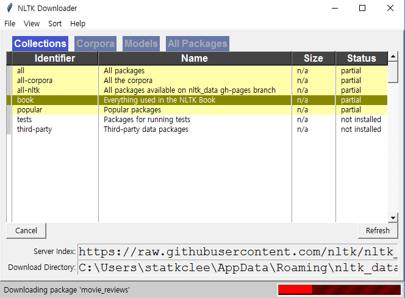
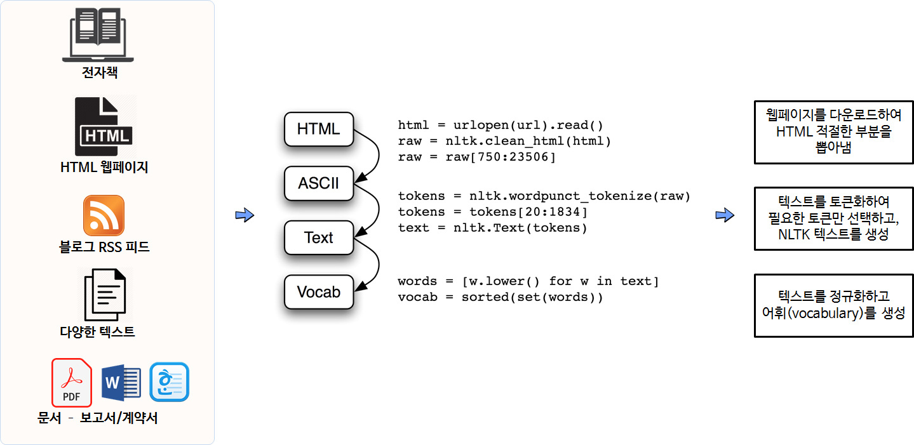
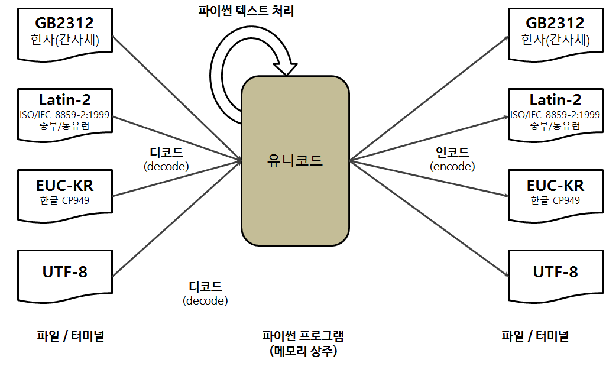

```{r setup, include=FALSE}
knitr::opts_chunk$set(echo = TRUE, message=FALSE, warning=FALSE,
                      comment="", digits = 3, tidy = FALSE, prompt = FALSE, fig.align = 'center')

library(reticulate)
use_condaenv("anaconda3")
# reticulate::repl_python()
```

# `nltk` 시작 [^nltk-python] {#nlp-basic}

[^nltk-python]: [Steven Bird, Ewan Klein, and Edward Loper (2009), "Natural Language Processing with Python - Analyzing Text with the Natural Language Toolkit"](https://www.nltk.org/book/)

파이썬 자연어 처리의 시작은 관련된 환경과 데이터를 받는 것부터 시작된다. `nltk`가 팩키작 되고 `nltk.download()` 함수로 `book`을 다운로드 받는 것부터 시작한다. `Everything used in the NLTK Book` 이름으로 된 책을 다운로드 받는데 시간이 다소 소요된다.


```{python nltk, eval=FALSE}
import nltk
nltk.download()
```
 


# 말뭉치(Corpus) {#nlp-corpus}

자연어 처리 연구는 말뭉치(Corpus)가 필요된다. 대표적인 것이 저작권이 만료된 책들을 모아놓은 구텐베르그 프로젝트를 비롯하여 연관된 말뭉치를 많이 찾을 수 있다.

- 구텐베르그 말뭉치: <http://www.gutenberg.org/>

`from nltk.book import *` 명령어를 통해서 텍스트 데이터를 얻을 필요없이 `nltk` 팩키지에 내장된 텍스트를 바탕으로 분석을 시작할 수도 있다.

```{python nltk-corpus}
from nltk.book import *

text1
```

다른 방식으로 일반적으로 외부에 원한느 데이터를 가져와서 자연어 처리를 하는 것을 사례로 들어 보자. 도스토예프스키의 죄와벌 [Crime and Punishment by Fyodor Dostoyevsky](http://www.gutenberg.org/ebooks/2554?msg=welcome_stranger) 영어 원문을 다운로드 받아보자. [http://www.gutenberg.org/files/2554/2554-0.txt](http://www.gutenberg.org/files/2554/2554-0.txt) 웹사이트를 지정하고 이를 가져와서 `utf-8`으로 변환시키면 영어원문 텍스트를 입수하게 된다.

```{python nltk-corpus-raw-data}
from urllib import request
url = "http://www.gutenberg.org/files/2554/2554-0.txt"
response = request.urlopen(url)
raw = response.read().decode('utf8')
type(raw)
len(raw)
raw[:100]
```

텍스트를 전처리하는 절차는 먼저 다양한 텍스트를 다운로드 받아 텍스트 형태로 저정시킨다. 그런 다음 불필요한 텍스트는 제거하고 어휘(vocabulary)를 분석가능한 형태로 저장시킨다.



# 유니코드(Unicode) [^finance-data-encoding] [^python-encoding] {#python-unicode}

[^finance-data-encoding]: [FianceData, "크롤링 데이터의 한글이 깨져요"](https://financedata.github.io/posts/faq_crawling_data_encoding.html)

[^python-encoding]: [또리장군 (2015-03-30), "python 3.x string type"](https://m.blog.naver.com/parkjy76/220315471598)

중국어는 GB2312, 중부/동유럽은 Latin-2, 한글은 EUC-KR 등 각국을 대표하는 문자체계가 있는데 이를 통합한 것이 유니코드(Unicode)로 이를 통해서 다시 영문이 아닌 각국 문자체계로 변환시킬 수 있다.

| 인코딩  | 문자 인코딩 시스템                     |        위키백과사전 주소  |
|---------|----------------------------------------|--------------------------------------|
| EUC-KR  | 한글 완성형	                           | https://ko.wikipedia.org/wiki/EUC-KR |
| CP949	  | 한글 완성형 (마이크로소프트사)         | https://ko.wikipedia.org/wiki/CP949 |
| UTF-8	  | 유니코드 8비트 (한글 1글자에 3바이트)  | https://ko.wikipedia.org/wiki/UTF-8 |
| UTF-16  | 유니코드 16비트 (한글 1글자에 2바이트) | https://ko.wikipedia.org/wiki/UTF-16 |



`chardet` 팩키지를 사용해서 `chardet.detect()` 메쏘드를 사용하게 되면 문자가 어떤 인코딩 체계를 따르고 있는지 확인이 가능하다. 추가로 문자열(string)은 구체적으로 보면 3가지 유형이 존재한다.

- `str` : ASCII를 포함한 디코드된 Unicode 텍스트의 표현
- `bytes` : 인코드된 텍스트를 포함 바이너리 데이타의 표현 (ASCII, Latin-1)
- `bytearray` : bytes의 mutable 지원

```{python unicode-korean}
import chardet

# 문자열 EUC-KR로 인코딩
euc_kr_string = '데이터 사이언스'.encode('euc-kr')
print( euc_kr_string )

# EUC-KR 인코딩 확인
print (chardet.detect (euc_kr_string))

# 문자열 UTF-8로 인코딩
utf_8_string = '데이터 사이언스'.encode('utf-8')
print( utf_8_string )

# UTF-8 인코딩 확인
print (chardet.detect (utf_8_string))

# UTF-8 문자 확인
print(chardet.detect(b"data science")['encoding'])
print(chardet.detect("데이터 사이언스".encode())['encoding'])
```

