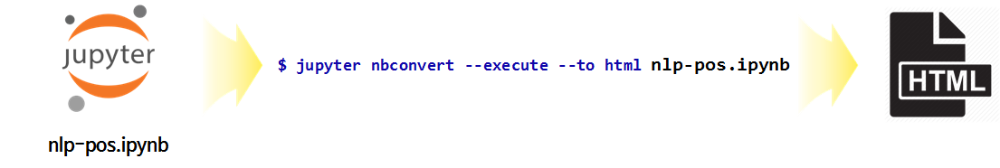

```{r setup, include=FALSE}
knitr::opts_chunk$set(echo = TRUE, message=FALSE, warning=FALSE,
                      comment="", digits = 3, tidy = FALSE, prompt = FALSE, fig.align = 'center')

library(reticulate)
use_condaenv("anaconda3")
# reticulate::repl_python()
```

# R 사용자 {#nlp-data-science-for-r-users}

먼저 R 사용자가 파이썬을 RStudio 환경에서 [xwMOOC 자연어 처리 - 텍스트, "R 파이썬을 만나다."](https://statkclee.github.io/text/text-r-meet-python.html) 블로그를 참조하여 파이썬 자연어 처리 코드를 작성할 수 있다.

하지만, 기본 모드가 R `>` 콘솔로 되어 있어 파이썬 `>>>`으로 변경시켜야 되면 시각화할 경우 `Qt` 오류가 발생하여 제대로 시각화를 못하는 경우도 왕왕 윈도우 환경에서 발생된다.

# 파이썬 쥬피터노트북 {#nlp-data-science-jupyter-notebook}

아나콘다를 설치하여 파이썬 자연어 분석 개발환경을 구축한 경우, 다음 두단계를 거쳐 `.html` 파일을 손쉽게 제작할 수 있다.

## 쥬피터 노트북 시작 디렉토리 [^jupyter-notebook-startup] {#nlp-data-science-jupyter-notebook-startup}

[^jupyter-notebook-startup]: [stackoverflow, "How to change the Jupyter start-up folder"](https://stackoverflow.com/questions/35254852/how-to-change-the-jupyter-start-up-folder)

쥬피터 노트북 시작 디렉토리를 원하는 곳으로 설정을 변경한다. 
이를 위해서 `jupyter_notebook_config.py` 파일을 생성시켜 이 파일에 원하는 디렉토리 정보를 입력시킨다.

```{r jupyter-notebook-startup, eval=FALSE}
$ jupyter notebook --generate-config
```

`jupyter notebook --generate-config` 명령어를 실행시키면 다음 디렉토리에 `jupyter_notebook_config.py` 파일이 생성된다. 
`<사용자명>`은 본인 계정명으로 대체시킨다.

```{r jupyter-notebook-startup-directory, eval=FALSE}
C:\Users\<사용자명>\.jupyter\jupyter_notebook_config.py
```

`jupyter_notebook_config.py` 파일을 텍스트 편집기로 열어서 다음과 같이 작업을 시작하는 디렉토리로 지정한다.

<div class = "row">
  <div class = "col-md-6">
**변경전**

`#c.NotebookApp.notebook_dir = ''` 주석처리되어 쥬피터 노트북이 실행될 때 기본디폴트로 설정된 값으로 실행된다.

``` {r jupyter-notebook-config-before, eval=FALSE}
.....
## Dict of Python modules to load as notebook server extensions.Entry values can
#  be used to enable and disable the loading ofthe extensions. The extensions
#  will be loaded in alphabetical order.
#c.NotebookApp.nbserver_extensions = {}

## The directory to use for notebooks and kernels.
#c.NotebookApp.notebook_dir = ''
.....
```

  </div>
  <div class = "col-md-6">
**변경 후**

'D:/docs/nlp' 디렉토리가 원하는 디렉토리를 주석을 제거하고 명시한다. 

``` {r jupyter-notebook-config-after, eval=FALSE}
.....
## Dict of Python modules to load as notebook server extensions.Entry values can
#  be used to enable and disable the loading ofthe extensions. The extensions
#  will be loaded in alphabetical order.
#c.NotebookApp.nbserver_extensions = {}

## The directory to use for notebooks and kernels.
c.NotebookApp.notebook_dir = 'D:/docs/nlp'
.....
```

  </div>
</div>

## 쥬피터 노트북 실행 {#nlp-data-science-jupyter-notebook-run}
  
`cmd` 명령어 혹은  `명령 프롬프트` 앱을 실행하게 되면 쉘이 구동된다. 프롬프트에서 `jupyter notebook`을 실행하게 되면 `c.NotebookApp.notebook_dir = 'D:/docs/nlp'` 설정에 따라 해당 디렉토리에서 쥬피터 노트북이 실행된 것이 확인된다.
  
## 쥬피터 노트북 `html` 변환 [^jupyter-to-html] {#nlp-data-science-jupyter-notebook-html}  

[^jupyter-to-html]: [stackoverflow, "How export a Jupyter notebook to HTML from the command line?"](https://stackoverflow.com/questions/36901154/how-export-a-jupyter-notebook-to-html-from-the-command-line)

`.ipynb` 확장자를 갖는 쥬피터 노트북을 웹에서 볼 수 있는 `.html` 파일로 변환시키려면 `jupyter nbconvert --execute --to html` 명령어를 사용한다.
시간이 너무 오래 걸려 제대로 `html` 변환이 되지 않는 경우 `--ExecutePreprocessor.enabled=True --ExecutePreprocessor.timeout=300`을 추가해 주고, `--template toc2`을 추가해 주면 큰제목, 작은제목에 숫자를 부여하고 좌측에 목차도 넣어준다.

`jupyter nbconvert --execute --to html nlp-word2vec-python.ipynb --ExecutePreprocessor.enabled=True --ExecutePreprocessor.timeout=300 --template toc2
`


  

# 쥬피터 노트북 [^jupyter-nb-toc] {#nlp-data-science-jupyter-nb}

[^jupyter-nb-toc]: [Stackoverflow, "Numbered headers in jupyter notebooks"](https://stackoverflow.com/questions/49189154/numbered-headers-in-jupyter-notebooks)

## 목차 제목 {#nlp-data-science-jupyter-nb-toc}

가장 먼저 쥬피터 노트북의 목차(ToC)에 숫자를 넣는 것이 가독성을 훨씬 높일 수 있다.

1. `nbextensions`를 설치한다.
    - `$ conda install -c conda-forge jupyter_contrib_nbextensions jupyter_nbextensions_configurator`
1. 쥬피터 노트북에 확장기능이 추가되면, 상단에 `Files`, `Running`, `Clusters` 옆에 `Nbextensions`탭이 추가되고 **Table of Contents (2)**을 활성화 시킨다.
1. 각 단계별로 새로고침을 누르게 되면 큰제목(`#`), 중간제목(`##`), ... 제목 수준에 맞춰 숫자가 붙은 것을 확인 할 수 있다.

## 단축키 [^jupyter-towards] [^shortcut-jupyter] {#nlp-data-science-jupyter-nb-shortcut}

[^shortcut-jupyter]: [꼬낄콘의 분석일지, "Jupyter 주요 단축키 모음"](https://kkokkilkon.tistory.com/151)

[^jupyter-towards]: [Towards Data Science - Sharing concepts, ideas, and codes, "What is Jupyter Notebook?"](https://towardsdatascience.com/jypyter-notebook-shortcuts-bf0101a98330)

쥬피터 노트북을 사용하게 될 경우 다음 단축키를 사용하여 생산성을 높일 수 있다.

- Shift + Enter: 현재 셀을 실행하고 아래 셀을 선택한다.
- Ctrl + Enter: 선택된 셀을 실행
- Alt + Enter: 현재 셀을 실행시키고, 아래 셀을 삽입시킴.
- Ctrl + S: 저장하고 체크포인트 설정

`esc`키를 누르게 되면 명령어 창에서 다음 명령어를 사용할 수 있게 된다.

- `Enter`: 편집모드
- `H`: 모든 단축키를 볼 수 있음.
- `Up`: 위쪽 셀 선택 
- `Down`: 아래 셀 선택
- `Shift` + `Up`: 위쪽 셀을 이어서 선택
- `Shift` + `Down`: 아래 셀을 이어어 선택
- `A`: 위에 셀을 삽입
- `B`: 아래 셀을 삽입
- `X`: 선택된 셀 잘래내기(cut)
- `C`: 선택된 셀을 복사(copy)
- `V`: 선택된 셀을 붙여넣기(paste)
- `Shift` + `V`: 셀 위에 붙여넣기(paste)
- `D`, `D` (두번 누룸): 선택된 셀을 삭제
- `Z`: 셀 삭제 실행취소
- `S`: 저장하고 체크포인트 지정
- `Y`: 셀 유형을 코드(code)로 변경
- `M`: 셀 유형을 마크다운(Markdown)으로 변경
- `P`: 명령 팔레트 열기
- `Shift` + `Space`: 노트북 위로 스크롤
- `Space`: 노트북 아래로 스크롤

# 쥬피터 노트북 폰트 [^custom-fonts] {#jupyter-nb-font}

[^custom-fonts]: [Jupyter Notebook 화면 조절 (폰트, 폰트 크기, 줄 간격)](https://pinkwink.kr/1039)

쥬피터 노트북으로 개발을 하게 되면 아무래도 한글폰트가 마음에 들지 않는 경우가 생기는데, 이런 경우 한글 폰트를 지정하여 개발환경을 쾌적하게 만들 수 있다.

결론은 `C:\Users\<사용자명>\.jupyter\custom\custom.css` 파일을 생성하고 
`custom.css` 파일 내부에 `D2Coding`와 같이 데이터 사이언스 한글 코딩 폰트를 명세하면 된다.

```{r custom-css, eval=FALSE}
# custom.css

.CodeMirror pre {font-family: D2Coding; font-size: 14pt; line-height: 140%;}
```

1. 윈도우 탐색기를 열고 ``C:\Users\<사용자명>\.jupyter` 디렉토리로 이동
1. `custom` 디렉토리 생성
1. `custom.css` 파일생성
    - `.CodeMirror pre {font-family: D2Coding; font-size: 12pt; line-height: 120%;}` 와 같이 폰트, 글꼴 크기, 행높이를 명세함.
