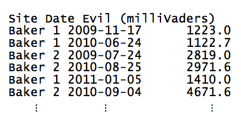
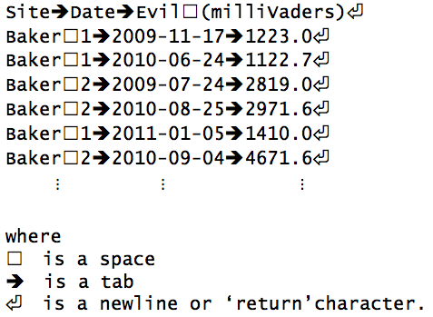
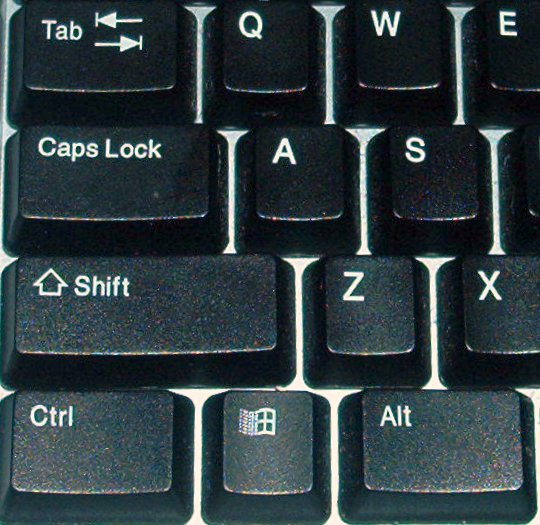
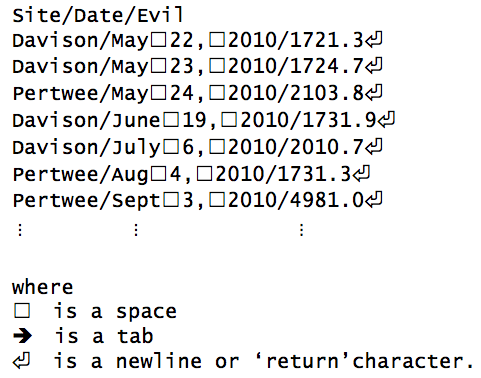

```{r setup, include=FALSE}
knitr::opts_chunk$set(echo = TRUE, message=FALSE, warning=FALSE,
                      comment="", digits = 3, tidy = FALSE, prompt = FALSE, fig.align = 'center')

library(reticulate)
use_condaenv("anaconda3")
# reticulate::repl_python()
```


몇년전에 죽음의 별이 폭발한 후에, 잘나가는 일간신문사 기자가 강원도 모처에 거주하는 일부 아이들이
이상하게 행동한다고 제보를 받았다. 지도교수가 대학원생을 급파해서 무슨 일이 일어나고 있는지
파악하도록 지시했다. 강원도 모처 다양한 지점에서 학생 모두가 수집한 악마레벨 측정정보가 
공책에 담겨있고, 나중에 데이터 파일로 저장되었다.

수행해야될 작업은 데이터 파일 20 혹은 30개를 읽어들이는 것인데,
파일 각각에는 악마수준별 수백개 측정정보가 기록되어 있어,
향후 처리작업을 도모하고자 일관된 형식으로 변환하는 것이다.
기록지 각각에는 측정한 장소명, 측정시간, 물론 milliVaders 단위 악마레벨 정보가 
담겨있다. 문제는 파일 각각이 다른 방식으로 형태가 달리 기록되어 있다는 점이다.
첫번째 기록지 예제가 다음에 나와 있다.



탭문자가 각 행에 담긴 필드 정보를 칼럼으로 구분하고 있다.
`Site` 지점명에는 공백이 들어 있고, 날짜는 국제표준형식으로 기록되어 있다: 
연도 숫자 4자리, 달 숫자 2자리, 날짜 숫자 2자리.

다음에 시각화해서 동일한 표정보를 표현한 파일이 있다.
두다지 도움이 되지 않는 탭과 공백을 파일 각 행별로 달리 표현한 방법에 주의한다.



> ### 탭 vs. 공백 {.callout}
> 
> [타자수](http://krdic.naver.com/detail.nhn?docid=39086300)를 기억하십니까?
> 물리적인 힘을 사용하는 무거운 기계장치로 막대끝에 활자조각을 때러 잉크가 묻은 리본이 
> 종이에 문자나 숫자를 찍게 된다. 이런 기계위에 적절히 표를 작성한다는 것은
> 상당한 인내와 더불어 정확하게 공백과 서식제어 백스페이스 사용이 요구된다.
> 이런 문제 대응하여, 타자기 제조업체가 `tabulate` 즉 `탭` 키를 발명했다.
> 탭키는 지정된 거리만큼 현재 출력위치를 옮기도록 해서 가장 기본적인 표 외관을 
> 잡는데 도움이 돼서 작업량을 상당히 줄여줬다.
> `탭` 키는 현재 사용되는 컴퓨터 키보드에도 장착되어 있고, 동일한 기능을 수행한다:
> 표에 칼럼사이 차이를 표현하고, 스페이스바 공백보다 훨씬 더 많이 커서 픽셀을 이동시킨다.
> 탭키는 보통 키보드 좌측상단에 위치한다.
> 
> 
> (이미지 출처: [위키피디아](http://commons.wikimedia.org/wiki/File:Keyboard-left_keys.jpg#mediaviewer/File:Keyboard-left_keys.jpg))

`탭(tab)`과 `공백(space)`은 키보드에 두가지 다른 키로,
각각의 키를 누를 때 키보드가 컴퓨터에 전달하는 부호화된 메시지는 완전히 다르다.
`탭(tab)` 키에 대한 부호코드는 `\t`로 표현되는 반면,
공백문자 코드는 보통 `\s`로 표현된다(슬래쉬를 통해 `t`와 `s` 문자와 차별화한다).
이를 통해 문자열에 `탭(tab)`과 `공백(space)`은 컴퓨터에게 다른 것을 의미한다.

옥에 티가 화면을 통해 텍스트 문자를 보여주는 프로그램이 `\t`와 `\s`를 작위적으로 렌더링함에 있다.
종종 프로그램이 `\t`를 가령 40 픽셀로 `\s`를 10 픽셀로 표현하지만, 모두 10 픽셀로 표현할 수도 있다.
심지어 완전히 다른 문자로 표현할 수도 있는데, 일반적인 표기법은 `\t`를 화살표로 표시한다. 그래서,
텍스틀 편집하는데 사용하는 프로그램에 대해 *정말* 알 때까지, 화면에 보이는 것을 믿을 수 없다. 
프로그램적으로 텍스트를 처리할 때, 분명하게 컴퓨터 프로그램에 대해 원하는 요구사항을 표현하려면, 
`탭(tab)`-`\t`와 `공백`-`\s` 사이 부호화된 인코딩 차이를 인식할 필요가 있다.

또다른 공책을 살펴보자:



명백하게 이번 공책은 앞선 것과 매우 다르다.
슬래쉬를 구분자로 사용하고 있다.
장소명에 공백이 없는 것으로 보이지만, 월명칭과 날짜 숫자에 길이가 가변적이다.
더욱 심각한 것은, 달명칭이 텍스트로 표기되어 있고, 날짜정보가 년-월-일이 아닌 월-일-년 순서로 되어 있다.

기본 문자열 연산자를 사용해서 파일을 파싱할 수 있지만, 힘들 것이다.
더 나은 접근법은 [정규표현식(Regular Expression)](http://ko.wikipedia.org/wiki/정규_표현식)을 사용하는 것이다. 정규표현식은 문자열을 매칭하는 패턴에 지나지 않는다.
실제로 정규표현식은 매우 흔하고 일반적으로 사용된다: `*.txt`를 컴퓨터에 제시할 때,
"`.txt`로 끝나는 모든 파일을 매칭하라"를 의미한다.
`*`는 정규표현식이다: `*`은 어떤 문자나 매칭한다.

정규표현식으로 무엇을 할 수 있고, 데이터를 처리하는데 어떻게 사용하는지 살펴본다.
다음으로 넘어가기 전에 경고사항이 있다: 정규표현식 표기법은 프로그래밍 기준으로 봐도 깔끔하지는 않다.
패턴을 작성해서 문자열을 매칭하지만, 키보드에 존재하는 기호만을 사용해서 *문자열로* 패턴을 작성한다.
이런 점이 수학자가 새로운 기호를 발명한다는 점에서 차이가 있다.
좋은 소식도 있는데, 거의 모든 프로그래밍 언어에서 거의 동일한 방식으로 정규표현식이 동작한다는 점이다.
파이썬으로 예제를 작성해서 제시하지만, 아이디어와 표기법은 곧바로 R, Go, 스칼라, 펄, 자바, 매트랩, C#, 포트란 등에도 적용된다.


