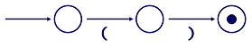

```{r setup, include=FALSE}
knitr::opts_chunk$set(echo = TRUE, message=FALSE, warning=FALSE,
                      comment="", digits = 3, tidy = FALSE, prompt = FALSE, fig.align = 'center')

library(reticulate)
use_condaenv("anaconda3")
# reticulate::repl_python()
```


# 추가 패턴 {#more-pattern}

정규표현식 동작원리를 알게 되어서, Notebook #3을 살펴보자:

``` {r more-pattern, eval = FALSE}
    Date Site Evil(mvad)
    May 29 2010 (Hartnell) 1029.3
    May 30 2010 (Hartnell) 1119.2
    June 1 2010 (Hartnell) 1319.4
    May 29 2010 (Troughton) 1419.3
    May 30 2010 (Troughton) 1420.0
    June 1 2010 (Troughton) 1419.8
    ⋮            ⋮           ⋮
```

상기 데이터는 날짜가 필드 세개로 구성되어 있고, 괄호에 장소명이 들어있고,
그리고 나서 측정값이 있다.
이런 형식을 갖는 날짜를 파싱하는 방법을 알고 있다.
필드는 공백으로 구분된다. 하지만, 괄호를 어떻게 매칭할 수 있을까?
지금까지 정규표현식에서 살펴본 괄호는 문자를 매칭하지 못한다: 괄호로 그룹집단을 생성했다.

이 문제를 해결하는 방식--즉, 문자 그대로 여는 괄호 '(' 혹은 닫는 괄호 ')'를 매칭하는 방법--은 괄호 앞에 역슬래쉬를 넣는 것이다. 이것이 [확장 비트열(escape sequence)](http://terms.naver.com/entry.nhn?docId=858903&cid=42346&categoryId=42346)의 또다른 사례다: 문자 그대로 탭문자를 표현하는데,
문자열에 `\t` 문자2개 시퀀스를 사용했듯이, 정규표현식에서 문자그대로 문자 '(' , ')'을 매칭하는데 문자2개 시퀀스로 `'\('` , `'\)'` 을 사용한다.

하지만, 문자열에서 역슬래쉬 '\\'을 추출하려면 이중으로 해서 *역슬래쉬* 를 빼내온다.
이것은 정규표현식과 아무 관련이 없다: 문자열에 역슬래쉬를 넣는 파이썬 규칙이다.
따라서 여는 괄호를 매칭하는 정규표현식 문자열 표현은 `'\\('`이 된다. 
혼동스러울 수 있다. 그래서 연관된 다양한 계층을 살펴보자.

프로그램 텍스트--즉, `.py` 파일로 저장된 것--는 다음과 같다:

``` {r python-more-pattern, eval=FALSE}
# find '()' in text
m = re.search('\\(\\)', text)
    ⋮    ⋮    ⋮
```

파일에 인용부호 내부에 역슬래쉬 두개, 여는 괄호, 역슬래쉬 두개, 닫는 괄호가 있다.
파이썬에서 상기 파일을 불러 읽어올 때, 문자2개 시퀀스 '\\\\'은 메모리 문자열에 단일 문자 
'\\'이 된다. 이것이 처음 빼내기한 결과가 된다.
'\\(\\)' 이 문자열을 정규표현식 라이브러리에 넘겨줄 때, 
정규표현식 라이브러리는 문자2개 시퀀스 '\\('을 건네받아서 문자 그대로 괄호를 매칭하는
유한상태기계에 화살표에 넣는다.



다른 말로 표현하면, 문자 그대로 괄호를 매칭하려면, 정규표현식 라이브러리에 '\\('을 전달해야만 된다.
문자열로 '\\('을 넣고자 한다면, `.py` 파일에 '\\\\('처럼 작성해야만 된다.

이를 잠시 옆으로 밀어 넣고서, Notebook #3 사례로 되돌아 가자.
각 레코드에서 필드 5개를 뽑아내는 정규표현식은 
`'([A-Z][a-z]+) ([0-9]{1,2}) ([0-9]{4}) \\((.+)\\) (.+)'` 이다.
이를 풀어보면 다음과 같다.

- 대문자 문자 하나 다음에 하나 혹은 그이상 소문자로 시작하는 단어
- 공백
- 1자리 혹은 2자리 숫자
- 4자리 숫자
- 또다른 공백 
- 역슬래쉬와 괄호와 관련된 패턴
- 또다른 공백
- 하나 혹은 그이상 문자로 구성된 측정값

괄호와 연관된 부분을 좀더 살펴보면, `'\\('` , `'\\)'` 이 데이터에 
존재하는 문자 그대로 여는 괄호 '(' , 닫는 괄호 ')' 문자를 매칭하는 정규표현식을 작성하는 방법이다.
앞에 역슬래쉬를 갖지 않는 두번째 내부 괄호는 그룹집단을 생성하지만, 어떤 문자 자체로 문자를 매칭하지는 않는다.
그룹을 생성해서 매칭되는 결과를 저장할 수 있다(이번 경우에, 장소명).

정규표현식에서 역슬래쉬로 작업하는 방식을 학습했기 때문에,
그자체로 축약되어 사용될 정도로 자주 활용되는 문자집합을 살펴보자.
정규표현식에서 `\d` 를 사용하면, 0에서 9까지 숫자를 매칭한다.
`\s` 를 사용하면, 화이트스페이스 문자, 공백, 탭, 개행, 개행복귀를 매칭한다.
`'\w'` 는 단어 문자를 매칭한다; 대문자, 소문자, 숫자, 밑줄에 대한 
`'[A-Za-z0-9_]'` 패턴집합과 동치다.
(사실 C 혹은 파이썬 같은 프로그래밍 언어 변수명에 나올 수 있는 문자 집합이다.)
다시, 파이썬 문자열로 정규표현식을 작성하려면, 이중 역슬래쉬를 사용해야 된다.

문자집합을 살펴봤기 때문에, 정말 잘못된 설계 사례를 살펴보자.
정규표현식 `'\s'` 은 "공백이 없는 문자", 즉 공백, 탭, 개행, 개행복귀 문자가 없는
모든 것이 된다. 앞 문단에서 언급한 것과 모순되어 보이지만,
면밀히 살펴보면, 소문자 's'가 아닌 대문자 'S'다.

유사하고, 동일하게 불운하게도, 대문자 'W'면, `'\W'` 은 "단어가 아닌 문자"를 의미한다.
대문자 소문자 'S', 'W'는 매우 유사하다.
특히, 문맥을 전달할 다른 문자가 없는 경우에는 더욱 그렇다.
이런 시퀀스는 잘못 타이핑하고 오독하기 매우 쉽다는 것을 의미한다.
소문자 's' 를 사용하고자 할 때 대문자 'S'를 사용하거나 그 반대의 경우,
다들 수시간을 이 문제를 해결하는데 소모한다는데 있다.
그래서 제발, 널리 사용될 것 같은 라이브러리를 설계할 때, 실수를 쉽게 유발하지 않는 
표기법을 채택하기 바랍니다.

문자집합 축약과 더불어, 정규표현식 라이브러리는 실제 문자가 아닌 단축키도 인식한다.
예를 들어, 패턴 시작점에 곡절 악센트 `'^'` 를 붙이면,
입력 텍스트 시작부분을 매칭한다. (곡절 악센트 앞에는 역슬래쉬가 없다.)
`'^mask'` 패턴은 `'mask size'` 텍스트를 매칭하는데 이유는 문자열 시작점에 'mask' 문자가 
나오기 때문이다. 하지만, `'unmask'` 문자는 매칭하지 *않는다*. 다른 반대 끝부분으로 가서,
달러기호 `'$'` 가 패턴 마지막 문자로 있으면, 문자 그대로 `'$'`를 매칭하기 보다는 행의 끝을 매칭한다.
그래서 `'temp\$'`은 `'high-temp'`를 매칭하지만 `'temperature'` 문자열은 매칭하지 않는다.

# 정규표현식과 개행 {#more-pattern-escape}

전체 규칙은 다소 복잡하다. 기본디폴트 설정으로, 정규표현식은 개행문자가 레코드 끝에 위치한 것을 가정하고 동작한다.
예를 들어, `'.'` 패턴은 개행문자를 *제외한* 모든 것을 매칭한다.
일반적으로 이런 설정이 문제가 되지는 않는데, 이유는 I/O 루틴 대부분이 한번에 텍스트 한줄을 반환하기 때문이다.
하지만, 전체 파일을 문자열 하나로 읽어들이는 경우, 행경계를 따라 매칭하는 경우 예상되는 동작결과를 얻지 못한다.
매칭에 `MULTILINE` 선택옵션을 사용해서 이런 문제를 예방한다; 자세한 내용은 정규표현식 문서를 참조한다.

종종 유용한 세번째 단축키는 `\b` 로 "break(중지)"로 불린다.
어떤 문자도 매칭하지 않는다; 대신에, 단어와 단어가 아닌 문자 사이 경계를 매칭한다("단어"는 대소문자, 숫자, 그리고 밑줄).
예를 들어, 정규표현식 `'\bage\b'` 은 문자열 `'the age of'`을 매칭하는데 이유는
'a' 바로 앞에 단어가 아닌 문자가 있고, 'e' 바로 다음에 또다른 단어가 아닌 문자가 있기 때문이다.
동일한 패턴이 `'phage'` 단어를 매칭하지는 않는데 이유는 단어가 아닌 문자에서 단어 문자로 전이가 없기 때문이다. 즉, 'a' 바로 앞에 전이가 없다. 그리고 프로그램에 정규표현식을 사용하려면, `'\\bage\\b'`을 사용해서 역슬래쉬를 빼내야 된다.


