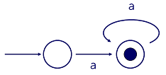

```{r setup, include=FALSE}
knitr::opts_chunk$set(echo = TRUE, message=FALSE, warning=FALSE,
                      comment="", digits = 3, tidy = FALSE, prompt = FALSE, fig.align = 'center')

library(reticulate)
use_condaenv("anaconda3")
# reticulate::repl_python()
```


# 작동원리(Under the Hood) {#under-the-hood}

정규표현식 `'([A-Z][a-z]+) ([0-9]{1,2}),? ([0-9]{4})'`은 대문자 한문자,
하나 혹은 그이상 소문자, 공백, 하나 혹은 두자리 숫자, 콤마는 선택, 또다른 공백, 마지막으로
정확하게 숫자 4자리가 된다.
무척 복잡하다. 컴퓨터가 실제로 처리하는 방법을 일부 이해하게 되면 
컴퓨터가 원하는 바를 수행하지 못할 때 정규표현식을 디버깅할 때 도움이 된다.

정규표현식은 [유한상태기계(Finite State Machine)](https://en.wikipedia.org/wiki/Finite-state_machine)을 사용해서 구현된다. 정확하게 소문자 'a'를 매칭하는 
매우 단순한 FSM이 다음에 나와 있다:


매칭은 촤측에서 들어오는 화살표로 시작되는데, 상기 유한상태기계의 첫번째 상태로 이동시킨다.
첫번째 상태에서 두번째 상태로 이동하는 유일한 방식은 1번 상태와 2번 상태 사이 'a'를 매칭시키는 것이다.
두번째 상태 중앙에 점은 최종 상태를 의미한다.
매칭이 적법하려면, 매칭이 끝난 후에 이런 상태중에 하나에 머물러야만 된다.

매우 단순한 정규표현식 `'a'` 를 매칭하는 FSM을 갖추었기 때문에,
약간 더 흥미로운 작업을 할 수 있는지 살펴보자.
다음에 문자 'a'를 1회 혹은 그 이상 매칭하는 유한상태기계가 있다.



'a' 라벨을 갖는 화살표를 통해 초기 상태에서 최종 상태로 이동한다. 하지만,
최종상태에서 멈출 필요는 없다: 위에 곡선 화살표가 또다른 'a'를 매칭해서, 
동일 상태로 다시 되돌려 놓는다.
그리고 나면 또다른 'a'가 있고, 무기한으로 이를 반복한다.
(처음 도달한 최종상태에서 멈출 필요는 없다: 입력이 모두 소진될 때 최종상태에 머무르면 됨에 주의한다.)
상기 FSM이 매칭하는 패턴이 `'a+'`가 되는데, 이유는 'a' 하나 다음에 0번 혹은 그 이상 다른 것이 있다는 것이
'a'가 1회 혹은 그이상 출현하는 것과 동일하기 때문이다.

문자 'a' 혹은 어떤 문자도 매칭하지 않는 또다른 FSM이 다음에 있다:


상단 곡선 화살표는 어떤 표식도 없어서, 전이가 자유롭다: 첫번째 상태에서 두번째 상태로 입력값을 
소모하지 않고 이동할 수 있다. 이것이 "a 혹은 단 하나도 없음"으로 `'a?'` 와 같다. 즉,
'a'가 선택옵션문자가 된다.

상기 정규표현식은 'a' 문자를 1회 혹은 그이상 매칭하는 것처럼 보인다.
다만, 추가 곡선 화살표가 있어서 첫번째 상태에서 두번째 상태로 입력값을 소모하지 않고 
이동함에 차이가 있다:


상기 FSM은 `'a*'` 패턴과 동치다. 즉, 아무것도 매칭하지 않거나
(처음 상태에서 두번째 상태로 자유롭게 전이하는 것으로 볼 수 있음)
1회 혹은 그이상 'a' 출현을
매칭한다. 다음과 같이 상기 FSM을 상당히 단순화할 수 있다:


지금까지 살펴본 단순한 FSM으로 이전 학습에 나온 정규표현식 대부분을 충분히 구현할 수 있다.
예를 들어, 다음 유한상태기계를 살펴보자:


상단 경로 혹은 하단 경로를 탈 수 있다.
상단 경로는 `a+` 가 된다; 하단 경로는 'b' 다음에 'c' 혹은 'd'가 된다.
그래서 두 경로를 조합한 전체 경로는 정규표현식 `'a+|(b(c|d))'` 와 동치가 된다.
정의된 경로를 매칭하는 입력문자열은 최종상태로 안내된다.

유한상태기계에 관한 가장 중요한 사실은 노드에서 취한 동작은 대상데이터 문자와 해당 노드 밖
화살표에만 의존한다는 점이다.
유한상태기계는 특정 노드에 도착하는 방법을 기억하지 *못한다*: 
의사결정은 항상 순수하게 지역적이다.

이것이 의미하는 바는 정규표현식이 매칭할 수 *없는* 많은 패턴이 있다는 것이다.
예를 들어, 중첩된 괄호를 매칭하는지를 검사하는 정규표현식 작성은 불가능하다.
'(((…)))'이 균형이 맞는지 검사하려면, 일종의 메모리가 필요하고, 최소한 계수기(counter)가 있어야 된다.
유한상태기계에는 이러한 것은 존재하지 않는다.

유사하게, 단어에 각 모음이 단 한번 포함되었는지 검사하려면, 이런 작업을 수행하는 유일한 방식은
120개 구(clause)을 갖는 정규표현식을 작성하는 것이다. 명시적으로 'aeiou'에 대한 가능한 모든
순열을 검사한다. 즉, 5*4*3*2*1 = 120.
임의 모음을 매칭하고 나서, 매칭될 모음 집합에서 해당 모음을 빼내야 되는 정규표현식을 작성할 수 없다.
왜냐하면, 이런 작업은 일종의 메모리가 필요한데, 유한상태기계는 메모리가 없기 때문이다.

이러한 한계에도 불구하고, 정규표현식은 매우 유용하다.
첫번째 이유는 유한상태기계는 매우 빠르다는 점이다.
컴퓨터가 사전-계산 작업을 수행한 후에(본질적으로, 
정규표현식을 유한상태기계로 변환하자마자), 
각 입력문자를 단지 한번만 살펴봄으로써, 정규표현식이 입력값에 매칭될 수 있다.
이것이 의미하는 바는 정규표현식으로 패턴을 찾는데 소요되는 시간이
데이터 크기에 비례해서 증가한다는 점이다.
대부분 다른 패턴-매칭 기법에 필요한 시간이 훨씬 더 빠르게 증가한다.
그래서, 만약 정규표현식이 매칭작업을 수행할 수 있다면, 
정규표현식이 거의 항상 가장 효율적인 선택지가 된다.

정규표현식을 사용하는 또다른 이유는 다른 대안보다 가독성이 더 좋다.
지금까지 예제를 살펴보면 그렇게 생각하지 않을 수도 있지만,
동일한 패턴을 매칭하는 코드를 작성하는 경우를 상상해보자.
어느 누구도 정규표현식이 이해하기 쉽다고 주장하지는 않지만,
20줄이 넘어가는 하위문자열 연산보다 정규표현식이 훨씬 더 쉽다.


